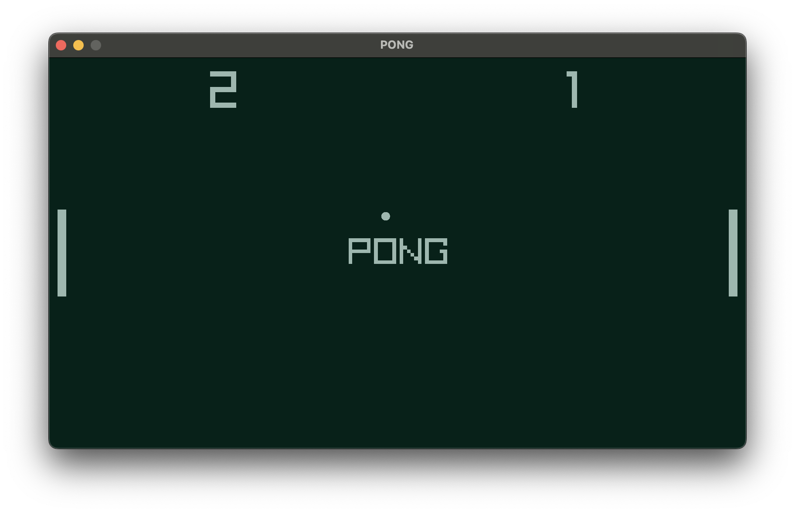

# Raylib Pong

Pong built using C++ and raylib.

;

## Requirements

- C++ Compiler (GCC, Clang, or MSVC)
- CMake 3.24 or higher (for CMake build)
- GNU Make (for Makefile build)
- VSCode (optional, for VSCode integration)

## Setup & Building

There are two ways to build this project:

### 1. Using VSCode and Makefile

#### Prerequisites

1. Install raylib in an `includes` folder in the parent directory:

```bash
cd ..
mkdir -p includes
cd includes
git clone https://github.com/raysan5/raylib.git
cd raylib/src
make PLATFORM=PLATFORM_DESKTOP
```

#### Building

1. Open the project in VSCode
2. The project includes preconfigured tasks for building:
   - Press `Cmd/Ctrl + Shift + B` to build in debug mode
   - Or use the VSCode command palette to select:
     - `build debug`: Builds with debug symbols
     - `build release`: Builds with optimizations
     - `clean`: Removes build artifacts

The executable will be created in the `build` directory.

### 2. Using CMake

#### Building

1. Configure and build the project:

```bash
# Configure
cmake -S . -B build

# Build
cmake --build build
```

The executable will be created in `build/raylib-game-template/`.

## Platform-Specific Notes

### macOS

- Requires Xcode Command Line Tools
- Additional frameworks are automatically linked (IOKit, Cocoa, OpenGL)

### Windows

- Requires MinGW or Visual Studio
- Required libraries are automatically linked

### Linux

- Requires development packages:
  ```bash
  # Ubuntu/Debian
  sudo apt-get install build-essential libgl1-mesa-dev
  # For X11
  sudo apt-get install libx11-dev libxrandr-dev libxinerama-dev libxcursor-dev libxi-dev
  ```

## Project Structure

```
├── src/               # Source files
│   ├── resources/    # Game resources (images, sounds, etc.)
│   ├── screens/      # Game screens (logo, title, gameplay, etc.)
│   └── pong.cpp # Main game file
├── build/            # Build output directory
└── .vscode/          # VSCode configuration
    ├── tasks.json    # Build tasks
    └── launch.json   # Debug configuration
```

## Debugging

The project includes VSCode debug configurations for both debug and release builds. To debug:

1. Build the project in debug mode
2. Press F5 or use the Run and Debug panel in VSCode
3. Choose either "Debug" or "Release" configuration

## Building for Web (Emscripten)

### Using CMake

```bash
cmake -DPLATFORM=Web -S . -B build
cmake --build build
```

### Using Makefile

1. Compile raylib for web

```bash
cd ../includes/raylib/src
make PLATFORM=PLATFORM_WEB
```

2. In root of the project

```bash
cd src
make PLATFORM=PLATFORM_WEB
```

## License

This project is licensed under an unmodified zlib/libpng license, which is an OSI-certified, BSD-like license that allows static linking with closed source software. Check [LICENSE](LICENSE) for further details.
